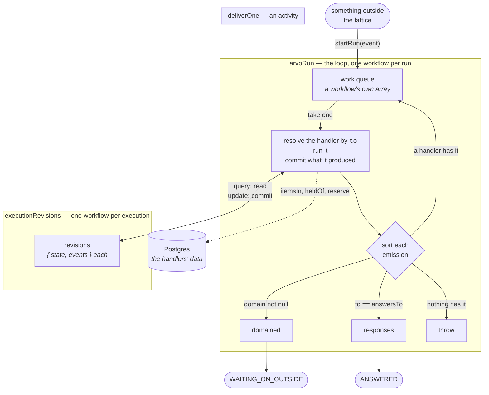
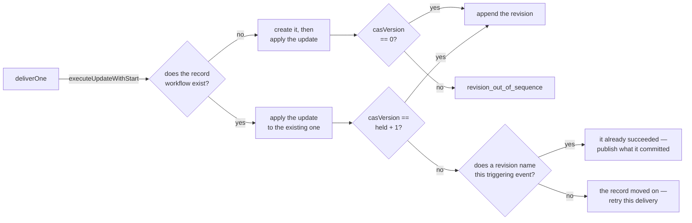

# The Temporal mechanism

One of two mechanisms running the same handlers. Both implement
`openspec/changes/declare-arvoeventhandler/mechanism_algorithm.md` and
differ only in how they hold the work queue and the record store.

**Nothing of this mechanism is stored outside Temporal.** No database, no
broker, no table. The work queue is a workflow's own array, an
execution's revisions are a workflow's own state, and the queues are task
queues.

Postgres appears exactly once in this directory, and not as the
mechanism's: the handlers read and write their own data through the
dependency factory, on a connection taken for one execution and given
back with it. What records an execution and what a handler reads are
different questions.

## The shape



Three parts, and each knows nothing about the others' business:

- **`arvoRun`** is the loop. It reads `source` once on the way in, and
  `domain` and `to` on each emission. It never asks whether an event
  opens an execution or answers one, which execution it concerns, or what
  a record should say.
- **`deliverOne`** is the only Arvo-aware code. It resolves the handler,
  runs it, and commits. It is also where the one fact the loop cannot see
  is settled — whether a handler exists for an address — because workflow
  code is bundled for an isolate that cannot import the handlers.
- **`executionRevisions`** is the record store. One workflow per
  execution, so writes to one record are serialized by Temporal admitting
  one workflow of a given name.

## One run, end to end

```mermaid
sequenceDiagram
    autonumber
    participant C as caller
    participant R as arvoRun
    participant D as deliverOne
    participant X as executionRevisions<br/>(order)
    participant L as executionRevisions<br/>(leaf)

    C->>R: startRun(order event)
    R->>D: deliver the order
    D->>X: read — nothing yet
    D->>X: commit revision 0 (waiting, 6 requests)
    D-->>R: 6 emissions
    Note over R: sorted: 5 work, 1 domained

    par the fan-out, all at once
        R->>D: deliver inventory check
        D->>L: commit revision 0 (success)
        D-->>R: 1 emission — the answer
    and
        R->>D: deliver payment charge
        Note over D: fails twice, retried<br/>with the fault's own delay
        D->>L: commit revision 0 (success)
        D-->>R: 1 emission
    and
        R->>D: deliver fraud check
        Note over D: fault, no retry in prospect
        D->>L: commit revision 0 (failure)<br/>+ the handler error event
        D-->>R: 1 emission
    end

    par the answers converge on one record
        R->>D: deliver an answer to the order
        D->>X: commit revision 1 — wins
    and
        R->>D: deliver another answer
        D->>X: commit revision 1 — loses
        Note over D: no revision names this event,<br/>so retry against the record as it now stands
        D->>X: commit revision 2 — wins
    end

    Note over R: work queue drains, domained is not empty
    R-->>C: WAITING_ON_OUTSIDE [the review]

    C->>R: answerFromOutside(decision)
    R->>D: deliver the decision
    D->>X: commit the last revision (success)
    D-->>R: the completion, and the audit write
    Note over R: the audit is work; the completion is the answer
    R-->>C: ANSWERED [evt_order_fulfilled]
```

Two things in that diagram are the whole point of running it.

**The convergence.** Deliveries go out in parallel, so several answers to
one execution each read revision *N* and write *N+1*. One wins. A loser
has not been carried out at all, so it is retried against the record as
it now stands — dropping it would lose the event, which is exactly the
bug this found. Losing is told apart from *having already succeeded* by
whether a revision names this delivery's own triggering event.

**The two endings.** A run ends because its work queue drained, and then
returns the first of: its responses, its domained events, or nothing. The
second of those is not a failure — it is an execution resting at
`waiting` because only something outside can answer it.

## Committing a revision



`executeUpdateWithStart` is what makes *commit at the first revision only
where no record exists* a single call rather than a read followed by a
write. Temporal has it off by default; `infra/temporal/dynamicconfig`
turns on updates and the multi-operation API it is built on, and the
mechanism does not work without both.

A revision is `{ state, events }` — the record **and** the events
committed with it, as one thing. That is what makes publishing
recoverable: whatever happens after the write, the events are still there
to be read back and sent, and nothing asks an executor to produce them a
second time.

## The files

| file | what |
|---|---|
| `workflows.ts` | the loop and the record. Bundled for an isolate, so it imports no handler and reaches nothing |
| `activities.ts` | one delivery: resolve by `to`, run the handler, commit. The only Arvo-aware code here |
| `record-store.ts` | reading a record is a query, committing one is an update-with-start |
| `protocol.ts` | the plain shapes the two sides pass, because the isolate cannot import the handlers |
| `queues.ts` | two task queues, so a wide run cannot starve its own records |
| `retry.ts` | a policy wider than any handler's budget, so the fault decides and not Temporal |
| `client.ts` | how something outside starts a run or answers one, and where a sender's obligations are checked |
| `workers.ts` | the workers, apart from the process, so a suite runs the ones a deployment runs |
| `worker.ts` | the process: config, health, bounded slots, graceful shutdown |
| `workflow-spans.ts` | workflow spans into this process's own pipeline, across an OpenTelemetry major version boundary |

## Running it

```bash
pnpm run distributed:up          # the cluster, and the telemetry stack
pnpm run distributed:migrate     # the handlers' own store
pnpm run distributed:temporal    # one whole run, end to end
```

To watch one instead of asserting on it, leave the workers up with
`pnpm run distributed:temporal:worker` and look at `localhost:8080` for
the workflows and `localhost:3000` for the traces.

## What a reader should be suspicious of

- **One workflow per execution makes the revision counter redundant**,
  because Temporal already admits one writer. It is kept because the
  protocol requires it and because it is the only thing that catches a
  delivery racing against a record that moved on — which happens on every
  wide fan-out here.
- **A record lives as long as its workflow's history is retained.** The
  namespace's retention is the store's retention, and that is a real
  difference from a table.
- **Parallel delivery is not in the algorithm.** The algorithm takes one
  event at a time. Delivering a batch at once is this mechanism's choice,
  and the convergence retry is what pays for it.
